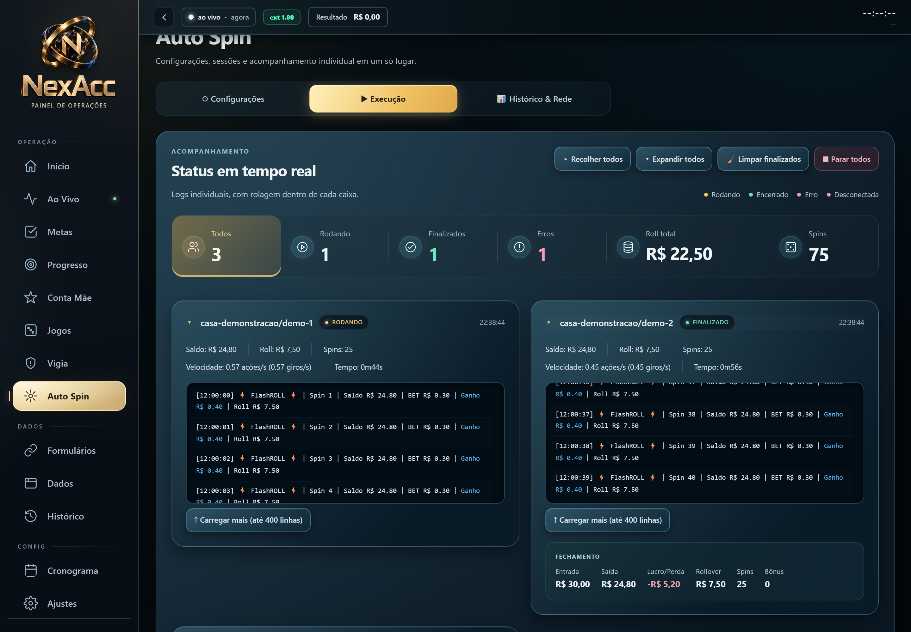

# NexAcc — Painel de Operações


**Projeto pessoal de estudo: interface web, API HTTP, banco de dados e integração por eventos.**

A NexAcc reúne registros, indicadores, histórico e cronograma em um painel executado localmente. Esta edição de portfólio apresenta a organização do código e os conceitos de engenharia explorados durante seu desenvolvimento, com dados de demonstração.

O projeto está **em desenvolvimento** e foi construído **com apoio de ferramentas de inteligência artificial**, em um processo de experimentação e aprendizado.

Minha participação se concentra na definição do visual, das funcionalidades e nas correções, com apoio de IA no desenvolvimento. A documentação descreve os mecanismos presentes no projeto e os pontos que quero aprofundar durante minha formação.

## Conheça o painel

A NexAcc é um painel local para organizar registros, acompanhar indicadores e consultar o histórico das operações. Minha participação está no visual, na definição das funcionalidades e nas correções, com apoio de IA.

**O que você pode conhecer aqui:**

- **Interface:** navegação, configurações e cartões de acompanhamento.
- **Organização dos dados:** registros, indicadores, histórico e cronograma.
- **Parte técnica:** API em Python, banco SQLite e entrega de eventos entre componentes.

### Prévia da interface



*Captura do projeto anterior à revisão desta edição de demonstração. Nomes e dados fictícios; a imagem não representa uma operação em andamento.*

[Ver mais imagens do painel](docs/IMAGENS/) · [Ver o tour animado](docs/IMAGENS/tour-painel.gif) · [Ver a apresentação no LinkedIn](https://www.linkedin.com/feed/update/urn:li:activity:7511997585155575808/)

**Este repositório não abre o painel funcionando no navegador.** Aqui estão as imagens, a documentação e o código da demonstração. A execução do sistema é local e exige configuração; consulte os requisitos e limites abaixo.

## Tecnologias

- **Python:** API HTTP com `http.server`, validação e arquivos estáticos. O servidor também depende de `requests`, importado por um módulo interno.
- **SQLite:** persistência, transações, migrações e exportação de snapshots.
- **HTML, CSS e JavaScript:** interface sem framework, organizada em módulos próprios.
- **PWA:** manifesto e service worker para recursos de apresentação; as rotas da API ficam fora do cache.
- **Chromium Manifest V3:** comunicação entre página, content script e service worker em testes isolados.
- **Python, Node.js e Playwright:** arquivos de teste e verificações de navegador.

## Conceitos explorados

- Transações SQLite com commit e rollback.
- Eventos com `event_id` e `revision`, recibos de entrega e verificação de conteúdo repetido.
- Fila persistida na extensão, novas tentativas e tratamento de recusas.
- Validação de entrada, controle de origem e servidor vinculado a `127.0.0.1`.
- Backups com hashes, contagens e indicação da cobertura do snapshot.
- Separação entre interface, API, armazenamento e integração de eventos.

Esses pontos descrevem mecanismos presentes no código. Sua confiabilidade depende de testes de comportamento e revisão contínua.

## Escopo da demonstração

Use dados sintéticos em um ambiente separado dos seus dados de uso diário. As extensões desta edição ficam restritas a `http://filhateste.invalid/*` e `http://maeteste.invalid/*`, endereços reservados usados pelas fixtures para simular páginas. A comunicação com o backend da demonstração usa `http://127.0.0.1:8765`. O armazenamento das extensões usa um namespace próprio para não importar filas de instalações anteriores.

O exportador de sessões foi retirado desta edição. O servidor aceita iniciar somente simulações com `dry_run: true`; a listagem de sessões reais fica vazia e a sincronização externa é recusada. Os parsers continuam tratando dados sintéticos que podem conter campos de identificação ou token. As extensões são destinadas exclusivamente aos testes isolados; não as instale em seu perfil pessoal.

Alguns arquivos mantêm o prefixo interno `agentum` por compatibilidade. O nome público é **NexAcc**. Componentes históricos de automação permanecem identificados no código; esta documentação não apresenta um fluxo de operação de apostas nem orienta a conexão a plataformas reais.

## Dependências e visualização local

O projeto original foi desenvolvido para Windows, com **Python 3.10+**. A compatibilidade completa com outros sistemas ainda precisa ser verificada. O requisito Python está em [`requirements.txt`](requirements.txt).

Em uma cópia dedicada à demonstração, crie e ative um ambiente virtual conforme seu sistema. Depois:

```sh
python -m pip install -r requirements.txt
python servidor.py
```

O painel é servido em `http://127.0.0.1:8765/index.html`. Para apresentar a interface, use um perfil separado e dados de exemplo; não importe backups reais. As extensões não são necessárias para ler o código ou conhecer a estrutura.

## Validação

O executor `run_tests.py` seleciona atualmente **47 arquivos de teste**. Cada arquivo pode conter vários casos; essa contagem, sozinha, não representa um resultado de aprovação.

Verificação parcial desta edição, em 02/10/2026:

- **54 casos Node aprovados:** `demo_privacidade`, `captura_worker`, `captura_integracao`, `captura_browser` e `captura_parser`. Apesar do nome, `captura_browser.test.cjs` usa uma VM simulada, não um navegador real.
- **4 testes Python aprovados:** `demo_limites` e `interface_backup_contract`.
- **28 verificações aprovadas** em `mae_confiabilidade.js`.

A suíte completa, os testes de navegador e a execução em Windows **não foram verificados nesta revisão**. Esses resultados não devem ser apresentados como aprovação integral do projeto.

Os testes usam Python e Node.js. Os de navegador também exigem o módulo Playwright e seu navegador correspondente. Há exemplos de banco temporário e API simulada. Novas execuções devem registrar comando, ambiente e resultados.

## Dados e comunicação externa

O servidor e o banco principal ficam na máquina do usuário. **Execução local não significa ausência de acesso à internet.** O código inclui integração opcional com Telegram e busca de imagens em CDN. Quando acionados, esses recursos podem transmitir dados ou metadados aos respectivos serviços.

Credenciais, bancos, backups, logs, arquivos de sessão e configurações privadas ficam fora do material de portfólio. O [`.gitignore`](.gitignore) ajuda a evitar inclusões acidentais, mas não substitui a revisão antes de publicar.

## Estrutura

```text
servidor.py, db.py, dados_*.py   API, persistência e validação
index.html, assets/             interface e identidade visual NexAcc
extensao/, extensao_agente/     integração no ambiente de fixtures
shared/                        módulos JavaScript compartilhados
testes/, run_tests.py           arquivos e executor de testes
docs/                          documentação e imagens
telegram/                      integração externa opcional
motor_autospin.py, autospin/    componentes históricos preservados
```

Detalhes em [Arquitetura](docs/ARQUITETURA.md).

## Autor e licença

**João Pedro Guimarães** — estudante de Ciência da Computação no Centro Universitário Barão de Mauá, interessado em estágio em TI e em construir uma trajetória em cibersegurança.

[GitHub](https://github.com/hause-g) · [LinkedIn](https://www.linkedin.com/in/jo%C3%A3o-pedro-guimar%C3%A3es-161653183/)

Licença [MIT](LICENSE).
